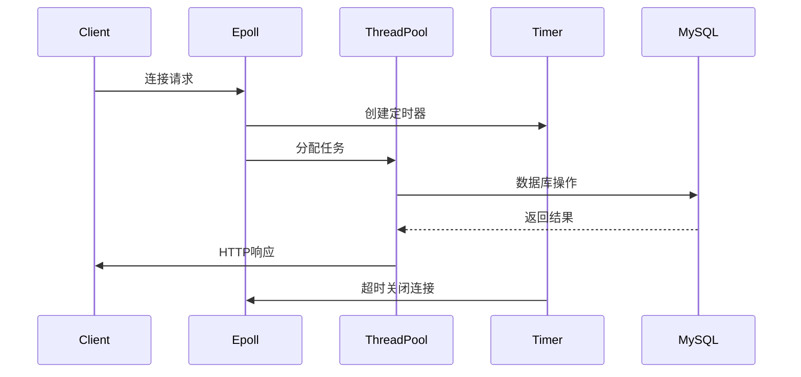
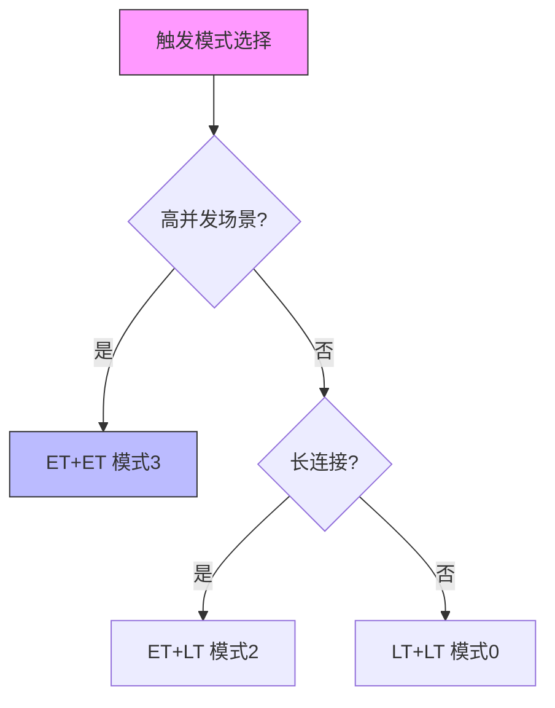

# WebServer 模块设计文档

## 架构概述
本服务器采用**事件驱动+线程池**架构，核心组件包括：
- I/O多路复用模块（Epoll ET/LT）
- 定时器管理模块（最小堆算法）
- 线程池模块（Reactor/Proactor模式可选）
- MySQL连接池模块
- 异步日志模块

组件交互流程：


## 核心类解析
```cpp
class WebServer {
public:
    // 初始化方法
    void init(int port, string user, string passWord, string databaseName, 
              int log_write, int opt_linger, int trigmode, int sql_num,
              int thread_num, int close_log, int actor_model);
    
    // 核心功能方法
    void eventListen();   // 事件监听
    void eventLoop();     // 事件循环
    void timer(...);      // 定时器管理
    // ...其他方法
private:
    // 关键成员
    int m_port;          // 监听端口
    threadpool<http_conn>* m_pool; // 线程池
    connection_pool* m_connPool;   // 数据库连接池
    // ...其他成员
};
```

## 核心模块解析

### 1. 初始化流程
```cpp
void WebServer::init(...) {
    m_port = port;                // 设置监听端口
    m_user = user;                // 数据库用户名
    m_passWord = passWord;        // 数据库密码
    m_databaseName = databaseName;// 数据库名
    m_sql_num = sql_num;          // 数据库连接数
    m_thread_num = thread_num;    // 线程池线程数
    m_TRIGMode = trigmode;        // 触发模式配置
    m_close_log = close_log;      // 日志开关
}
```

### 2. 事件处理机制
采用epoll ET/LT模式+信号管道：
```cpp
void WebServer::eventListen() {
    // 创建监听socket
    m_listenfd = socket(PF_INET, SOCK_STREAM, 0);
    
    // 绑定端口
    bind(m_listenfd, (sockaddr*)&address, sizeof(address));
    
    // 创建epoll实例
    m_epollfd = epoll_create(5);
    
    // 设置信号管道
    socketpair(PF_UNIX, SOCK_STREAM, 0, m_pipefd);
    
    // 注册信号处理
    utils.addsig(SIGALRM, utils.sig_handler); // 定时信号
    utils.addsig(SIGTERM, utils.sig_handler); // 终止信号
}
```

### 3. 定时器管理
```cpp
// 添加定时器
void WebServer::timer(int connfd, sockaddr_in client_address) {
    util_timer* timer = new util_timer;
    timer->expire = time(NULL) + 3 * TIMESLOT;
    utils.m_timer_lst.add_timer(timer);
}

// 定时器回调函数
void cb_func(client_data* user_data) {
    epoll_ctl(Utils::u_epollfd, EPOLL_CTL_DEL, 
             user_data->sockfd, 0);
    close(user_data->sockfd);
    http_conn::m_user_count--;
}
```

### 4. 线程池配置
```cpp
void WebServer::thread_pool() {
    m_pool = new threadpool<http_conn>(
        m_actormodel,    // Reactor(1)/Proactor(0)
        m_connPool,      // 数据库连接池
        m_thread_num     // 线程数量
    );
}
```

## 关键配置参数

| 参数名          | 说明                  | 默认值 |
|-----------------|----------------------|--------|
| MAX_FD          | 最大文件描述符数      | 65536  |
| MAX_EVENT_NUMBER| epoll最大事件数       | 10000  |
| TIMESLOT        | 定时器基础时间单元(s) | 5      |
| m_TRIGMode      | 触发模式组合          | 0-3    |

## 触发模式深度解析



### 模式对照表
| 模式 | 监听套接字触发方式 | 连接套接字触发方式 | 适用场景               | 性能影响         |
|------|--------------------|--------------------|------------------------|------------------|
| 0    | LT                 | LT                 | 低并发、调试环境       | CPU占用低        |
| 1    | LT                 | ET                 | 混合型负载             | 中等             |
| 2    | ET                 | LT                 | 大文件传输             | 较高             |
| 3    | ET                 | ET                 | 高并发实时系统         | 最高             |

### 编译运行指南
```bash
# 调试模式（模式0）
make clean && make TRIGMode=0 CLOSE_LOG=0

# 生产模式（模式3）
make clean && make TRIGMode=3 CLOSE_LOG=1

# 运行服务器（参数说明：-p端口 -t线程数 -sSQL连接数 -l日志开关）
./server -p 9006 -t 12 -s 16 -l 1
```

### 压力测试（使用webbench）
```bash
# 安装测试工具
cd test_pressure/webbench-1.5
make && sudo cp webbench /usr/local/bin

# 执行测试（1000并发，持续30秒）
webbench -c 1000 -t 30 http://localhost:9006/
```

## 日志系统配置
```cpp
void WebServer::log_write() {
    Log::get_instance()->init(
        "./ServerLog",   // 日志路径
        m_close_log,     // 日志开关
        2000,           // 最大行数
        800000,         // 队列最大长度
        m_log_write ? 800 : 0 // 异步写入配置
    );
}